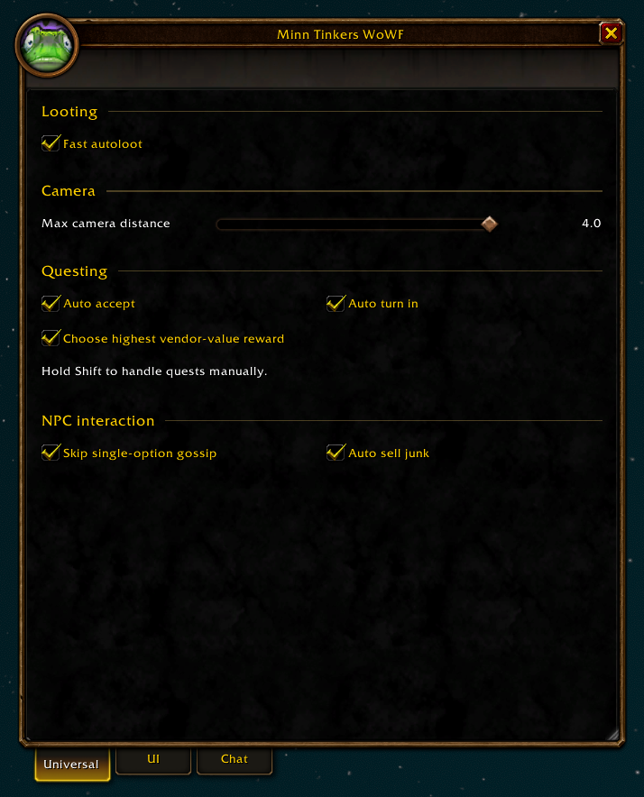
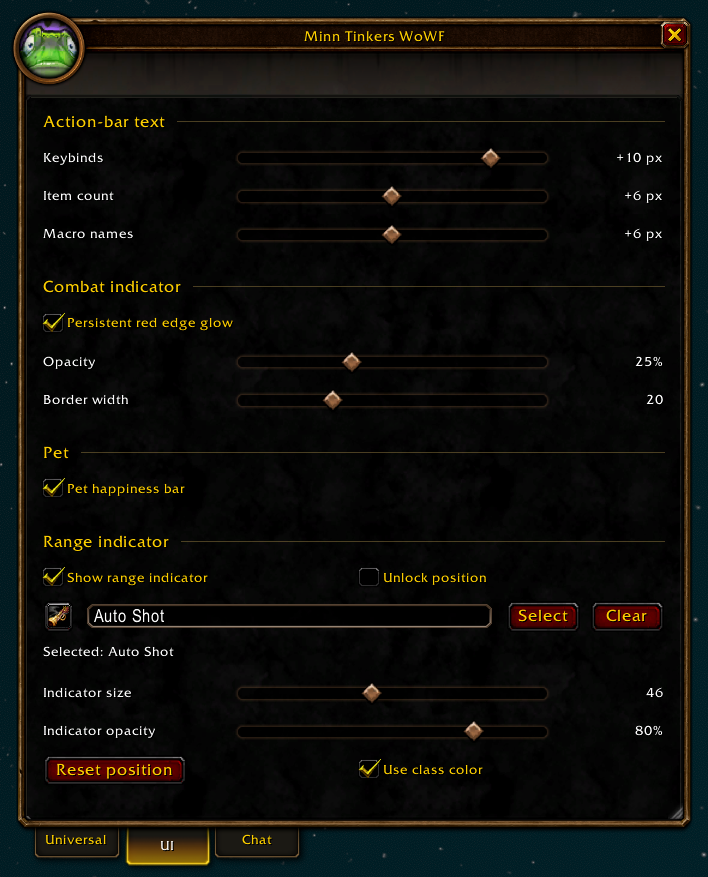
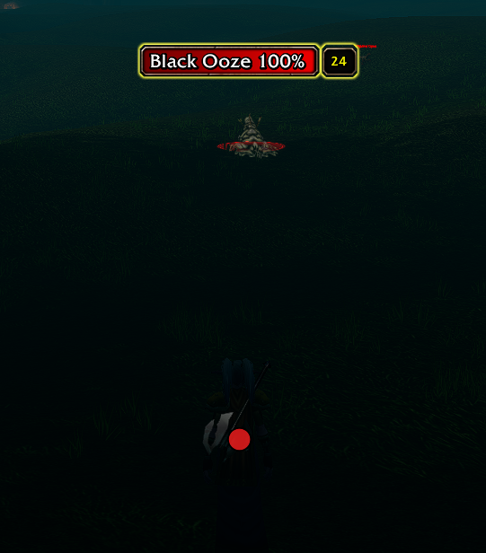
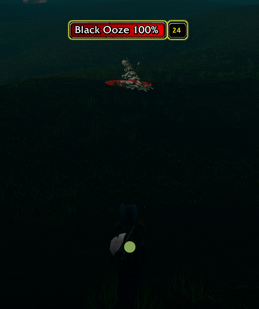
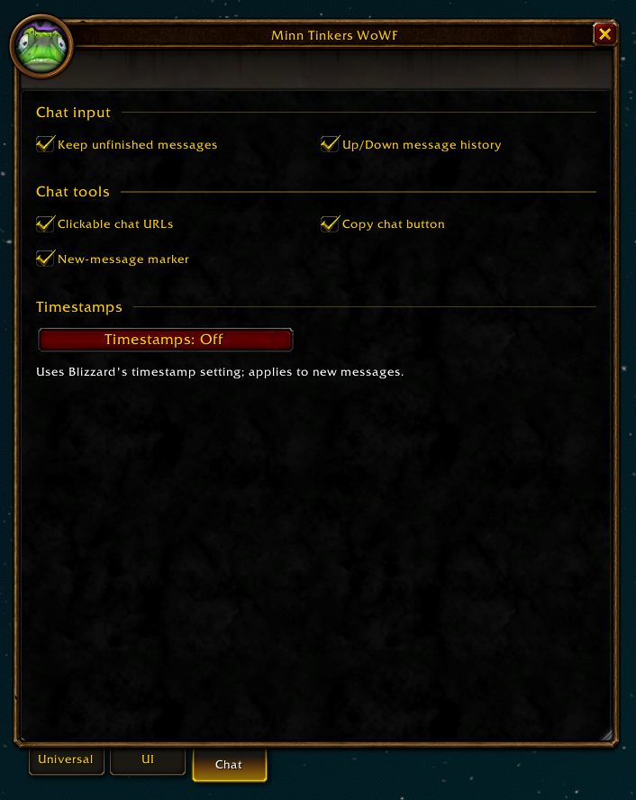

[**Download the latest ZIP**](https://github.com/Minnona/Minn-Tinkers-WoWF/releases/latest/download/Minn-Tinkers-WoWF.zip)

# Minn Tinkers WoWF

Quality-of-life settings for **World of Warcraft: Forever**.

Extract the ZIP into `Interface/AddOns/`, keeping the folder named `Minn Tinkers WoWF`. Open settings with **`/minn`** or the frog minimap button.

## Universal

- **Fast autoloot:** skips the automatic loot window, with native fallback when needed.
- **Camera distance:** adjustable maximum zoom-out limit, up to 4.0.
- **Questing:** auto accept and turn in, skipping unlimited repeatables. Zero or one reward choice auto-completes; two or more require manual completion, with optional highest vendor-value preselection. Hold **Shift** to handle quests manually.
- **Gossip:** skip an NPC's sole dialogue option when no quests are listed.
- **Junk selling:** automatically sell grey items, respecting excluded bags.

## UI

- **Action-bar fonts:** separate sizes for keybinds, item counts and macro names.
- **Combat indicator:** persistent red edge glow with adjustable opacity and width.
- **Range indicator:** movable target range dot with adjustable size and opacity; choose white or your character's native class color when in range. Select a spell by name or drop it from the spellbook. Includes position reset and per-character settings.

Pet settings shown in the screenshot have moved to **Hunter**.

Range indicator examples using the hunter class color:

| Out of range (red) | In range (class color) |
| --- | --- |
|  |  |

## Chat

- **Chat input:** Escape preserves unsent text for the current session; Up/Down recalls the last 32 sent messages, saved per character across reloads and normal exits. Protected commands such as `/target` are skipped; type them directly.
- **Chat URLs:** click web addresses, including `discord.gg/invite`, to open a copy popup; press **Ctrl+C**.
- **Copy chat:** toggle a copy window with the button beside chat input; use **Ctrl+A**, then **Ctrl+C**.
- **Unread messages:** a thin class-colored glow pulses along the bottom of chat while new messages are waiting; clears when you reach the bottom.
- **Saved chat:** up to 200 displayed messages per permanent window, with colors and links, restored per character after reloads and normal logouts/game exits. Excludes combat log, temporary windows and restricted messages. Crashes may lose recent messages.
- **Timestamps:** choose Blizzard's native timestamp format for new messages.

## Hunter

Shown only for hunters. The range indicator stays in **UI**.

- **Pet happiness:** thin red/yellow/green happiness reserve bar below pet focus, with native trim and tooltip.
- **Trueshot Aura reminder:** a movable, resizable native spell button appears when the buff is missing or has one minute left. Click to buff; it hides after the aura refreshes. Hidden in combat and during flight paths.
Author: **Minnona (Northdale)**. Licensed under [GPLv3](LICENSE) (GPL-3.0-only).
